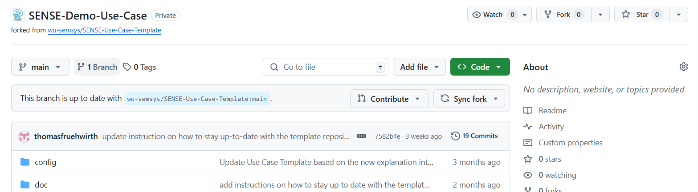

# Use Case Template

We provide this Use Case Template repository as a starting point for creating a new SENSE instance from the [SENSE Core](https://github.com/wu-semsys/SENSE-Core). Check out the SENSE Core documentation for information about the general concept and detailed information about the individual modules.

## Table of Conents
- [SENSE Use Case Instantiation Instructions](#sense-use-case-instantiation-instructions)
- [1. Fork the SENSE Use Case Template](#1-fork-the-sense-use-case-template)
- [2. Prepare the Use-Case-Specific Information](#2-prepare-the-use-case-specific-information)
- [3. Generate system-data.ttl ](#3-generate-system-datattl)
- [4. Set up a Connection to an Existing InfluxDB Instance](#4-set-up-a-connection-to-an-existing-influxdb-instance)
- [5. Optional: Build the Docker Images](#5-optional-build-the-docker-images)
- [6. Run the Application](#6-run-the-application)
- [7. Request Events and Explanations](#7-request-events-and-explanations)
- [8. Stay Up to Date With the Template Repository](#8-stay-up-to-date-with-the-template-repository)

## SENSE Use Case Instantiation Instructions
There are several steps listed below that will create a new use-case-specific repository from this Use Case Template repository and populate the template with use-case-specific information. Note that, on several occasions, it is necessary to define a name for the use case. We use use_case_name as a placeholder. 

### 1. Fork the SENSE Use Case Template
#### Option 1: Host the Use Case on GitHub
If your use-case-specific instance of SENSE should be hosted on GitHub, utilize the GitHub fork functionality to create a fork of this repository.

#### Option 2: Host on a Different Git Server
If you need to host your use-case-specific instance of SENSE on a different Git server, follow the steps below:
1. Create an empty repository on your Git server, but do not initialize it with any files
2. Clone the repository you've just created to your local machine using the following commands (adjust the placeholders accordingly):
```bash
git clone git@git_server_url:git_username_or_organization/use_case_name.git
cd use_case_name
```

2. Add the Use Case Template repository as remote repository named "upstream":
```bash
git remote add upstream https://github.com/wu-semsys/SENSE-Use-Case-Template.git
```
3. Fetch the latest changes from the remote repository "upstream" using the command:
```bash
git fetch upstream
```
4. Merge into your local branch:
```bash
git merge remotes/upstream/main
```

#### Resulting File Structure
Either way, forking the repository will result in the following file structure:

```bash
├── README.md (# this README file)
├── compose.yml # (docker compose file)
├── config # (configuration files for all modules)
│   ├── config.docker.json
├── infrastructure # (additional module-specific configuration and data files)
│   └── knowledgebase
│       ├── SystemData.xlsx
│       ├── data
│       │   └── SENSE.ttl
│       ├── graphdb_repo_config.ttl
│       └── reasoning
│           └── event-reasoning.ttl
└── tools
    └── requirements.txt # python package requirements for XLSXtoTTL.py
    └── XLSXtoTTL.py # script for converting SystemData.xlsx to system-data.ttl
```

#### Replacing the use_case_name Placeholder with an Expressive Name

Note: The use_case_name placeholder is currently quite havily used. We are working on reducing the number of occurances. We suggest search-and-replace for replacing the use_case_name with an expressive name for your use case. For now, it is present in the following files:
Note: In config.json, keys labeled with (Optional) can be fully removed and should only be included if needed. (If you choose to use them, be sure to remove the (Optional) text from their names)

```bash
./config/config.docker.json
./infrastructure/knowledgebase/graphdb_repo_config.ttl
./infrastructure/knowledgebase/reasoning/event-reasoning.ttl
```

### 2. Prepare the Use-Case-Specific Information
Follow our user guideline that we published as part of the SENSE Deliverable D5.1 [SENSE Deliverables](https://sense-project.net/deliverables/). During this step, the use-case-specific information will be collected and used to populate the [SystemData.xlsx](./infrastructure/knowledgebase/SystemData.xlsx) file. 

### 3. Generate system-data.ttl 
The [SystemData.xlsx](./infrastructure/knowledgebase/SystemData.xlsx) has to be converted to a Turtle (ttl) file, before it can be used by the SENSE system. We provide a script for this purpose.

```bash
cd tools

# install required python packages
pip install -r requirements.txt

# create system-data.ttl from SystemData.xlsx
python3 XLSXtoTTL.py "http://example.org/use_case_name#" \
    ../infrastructure/knowledgebase/SystemData.xlsx \
    ../infrastructure/knowledgebase/data/system-data.ttl \
    --shacl-path "../infrastructure/knowledgebase/sense-validation v1.0.shacl"
```

### 4. Set up a Connection to an Existing InfluxDB Instance
The SENSE system needs to connect to an existing InfluxDB database to access data that should be monitored and explained. Additional information on how to configure the data-ingestion module accordingly is provided in the [README file of the data-ingestion module](https://github.com/wu-semsys/SENSE-Core/blob/main/sense_core/data_ingestion/README.md)

### 5. Build the Docker Images
You need to create Docker images of the SENSE Core modules before running the application:
```
cd sense_core
docker build -t sense-core/data-ingestion:v1.0 -f data_ingestion.Containerfile .
docker build -t sense-core/event-to-state-causality:v1.0 -f event_to_state_causality.Containerfile .
docker build -t sense-core/explanation-interface:v1.0 -f explanation_interface.Containerfile .
docker build -t sense-core/knowledgebase:v1.0 -f knowledgebase.amd64.Containerfile .
docker build -t sense-core/semantic-event-log-bridge:v1.0 -f semantic_event_log_bridge.Containerfile .
docker build -t sense-core/simple-event-detection:v1.0 -f simple_event_detection.Containerfile .
```

### 6. Run the Application
Once the images are available locally and everything is configured as outlined in the previous steps, you can start the use-case-specific SENSE instance using
```bash
docker compose up
```

### 7. Request Events and Explanations

Refer to [https://github.com/wu-semsys/SENSE-Core/blob/main/sense_core/simple_event_detection/README.md](https://github.com/wu-semsys/SENSE-Core/blob/main/sense_core/simple_event_detection/README.md) for instructions on how to retrieve a list of **events** from your SENSE system instantiation.

Refer to [https://github.com/wu-semsys/SENSE-Core/blob/main/sense_core/explanation-interface/README.md](https://github.com/wu-semsys/SENSE-Core/blob/main/sense_core/explanation-interface/README.md) for instructions on how to retrieve **explanations** for events from your SENSE system instantiation. 

### 8. Stay Up to Date With the Template Repository
While working on your use case, the SENSE team might push changes to the template repository, such as support for additional event and explanation types. To stay updated, you can either use the builtin options of GitLab or the Git Command Line Interface (CLI).

#### Sync via the GitLab User Interface
GitHub will keep you informed about changes in the template repository. In the screenshot below, it's up to date:



#### Sync via the CLI
You can also use the CLI to stay in sync with the template repository (possibly on a more granular level). First, create a temporary feature branch to work on the merge and immediately switch to this new branch.

```bash
git checkout -b feature/merge-template-update
```

Next, add the template repository to your use case repository as a secondary remote called ```upstream```.

```bash
git remote add upstream https://github.com/wu-semsys/SENSE-Use-Case-Template.git
```

Next, pull the main branch of the upstream (template) repository. 
```bash
git pull upstream main
```

In case you did not create your use case repository by forking the template, the above commands may fail with ```fatal: refusing to merge unrelated histories```. In this case use:

```bash
git pull upstream main --allow-unrelated-histories
```

Note that this might result in a significant number of merge conflicts that need to be addressed. 

Finally, commit and push the changes to the main branch of your use case repository.
